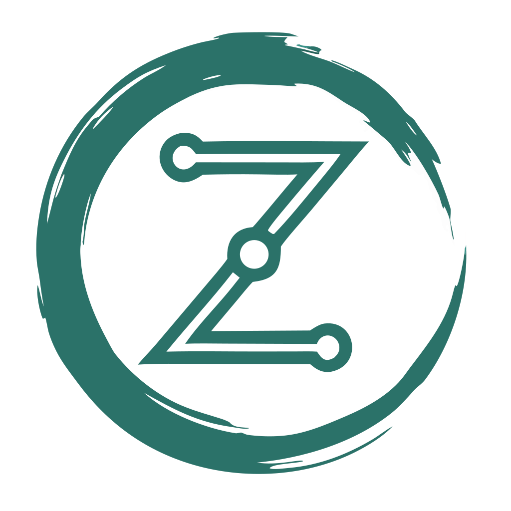

<p align="center">
  
  <h1 align="center">Multi-Agent Memory</h1>
  <p align="center">
    Cross-machine, cross-agent persistent memory for AI systems
  </p>
  <p align="center">
    <a href="#quick-start">Quick Start</a> &bull;
    <a href="#features">Features</a> &bull;
    <a href="#api-reference">API</a> &bull;
    <a href="#adapters">Adapters</a> &bull;
    <a href="#configuration">Config</a> &bull;
    <a href="#roadmap">Roadmap</a>
  </p>
  <p align="center">
    
    
    
    
  </p>
  <p align="center">
    
  </p>
</p>

---

**Multi-Agent Memory** gives your AI agents a shared brain that works across machines, tools, and frameworks. Store a fact from Claude Code on your laptop, recall it from an OpenClaw agent on your server, and get a briefing from n8n — all through the same memory system.

Born from a production setup where [OpenClaw](https://github.com/openclaw/openclaw) agents, Claude Code, and n8n workflows needed to share memory across separate machines. Nothing existed that did this well, so we built it.

## The Problem

You run multiple AI agents — Claude Code for development, OpenClaw for autonomous tasks, n8n for automation. They each maintain their own context and forget everything between sessions. When one agent discovers something important, the others never learn about it.

Existing solutions are either single-machine only, require paid cloud services, or treat memory as a flat key-value store without understanding that a *fact* and an *event* are fundamentally different things.

## Quick Start

```bash
# 1. Clone the repo
git clone https://github.com/ZenSystemAI/multi-agent-memory.git
cd multi-agent-memory

# 2. Configure
cp .env.example .env
# Edit .env — set BRAIN_API_KEY, OPENAI_API_KEY, and QDRANT_API_KEY

# 3. Start services
docker compose up -d

# 4. Verify
curl http://localhost:8084/health
# {"status":"ok","service":"shared-brain","timestamp":"..."}

# 5. Store your first memory
curl -X POST http://localhost:8084/memory \
  -H "Content-Type: application/json" \
  -H "X-Api-Key: YOUR_KEY" \
  -d '{
    "type": "fact",
    "content": "The API uses port 8084 by default",
    "source_agent": "my-agent",
    "key": "api-default-port"
  }'
```

## Features

### Typed Memory with Mutation Semantics

Not all memories are equal. Multi-Agent Memory understands four distinct types, each with its own lifecycle:

| Type | Behavior | Use Case |
|------|----------|----------|
| **event** | Append-only. Immutable historical record. | "Deployment completed", "Workflow failed" |
| **fact** | Upsert by `key`. New facts supersede old ones. | "API status: healthy", "Client prefers dark mode" |
| **status** | Update-in-place by `subject`. Latest wins. | "build-pipeline: passing", "migration: in-progress" |
| **decision** | Append-only. Records choices and reasoning. | "Chose Postgres over MySQL because..." |

### Memory Lifecycle

```
Store ──> Dedup Check ──> Supersedes Chain ──> Confidence Decay ──> LLM Consolidation
  │            │                 │                    │                     │
  │     Exact match?      Same key/subject?    Score drops over      Groups, merges,
  │     Return existing   Mark old inactive    time without access   finds insights
  │                                                                        │
  └────────────────────────── Vector + Structured DB ──────────────────────┘
```

**Deduplication** — Content is hashed on storage. Exact duplicates are caught and return the existing memory instead of creating a new one.

**Supersedes** — When you store a fact with the same `key` as an existing fact, the old one is marked inactive and the new one links back to it. Same pattern for statuses by `subject`. Old versions remain searchable but rank lower.

**Confidence Decay** — Facts and statuses lose confidence over time if not accessed (configurable, default 2%/day). Events and decisions don't decay — they're historical records. Accessing a memory resets its decay clock. Search results are ranked by `similarity * confidence`.

**LLM Consolidation** — A periodic background process (configurable, default every 6 hours) sends unconsolidated memories to an LLM that finds duplicates to merge, contradictions to flag, connections between memories, and cross-memory insights. Nobody else has this.

### Credential Scrubbing

All content is scrubbed before storage. API keys, JWTs, SSH private keys, passwords, and base64-encoded secrets are automatically redacted. Agents can freely share context without accidentally leaking credentials into long-term memory.

### Agent Isolation

The API acts as a gatekeeper between your agents and the data. No agent — whether it's an OpenClaw agent, Claude Code, or a rogue script — has direct access to Qdrant or the database. They can only do what the API allows:

- **Store** and **search** memories (through validated endpoints)
- **Read** briefings and stats

They **cannot**:
- Delete memories or drop tables
- Bypass credential scrubbing
- Access the filesystem or database directly
- Modify other agents' memories retroactively

This is by design. Autonomous agents like OpenClaw run unattended on separate machines. If one hallucinates or goes off-script, the worst it can do is store bad data — it can't destroy good data. Compare that to systems where the agent has direct SQLite access on the same machine: one bad command and your memory is gone.

### Security

- **Timing-safe authentication** — API key comparison uses `crypto.timingSafeEqual()` to prevent timing attacks
- **Rate limiting** — Failed authentication attempts are rate-limited per IP (10 failures/minute before lockout)
- **Startup validation** — The API refuses to start without required environment variables configured
- **Credential scrubbing** — All stored content is scrubbed for API keys, tokens, passwords, and secrets before storage

### Session Briefings

Start every session by asking "what happened since I was last here?" The briefing endpoint returns categorized updates from all other agents, excluding the requesting agent's own entries. No more context loss between sessions.

```bash
curl "http://localhost:8084/briefing?since=2025-01-01T00:00:00Z&agent=claude-code" \
  -H "X-Api-Key: YOUR_KEY"
```

### Dual Storage

Every memory is stored in two places:
- **Qdrant** (vector database) — for semantic search, similarity matching, and confidence scoring
- **Structured database** — for exact queries, filtering, and structured lookups

This means you get both "find memories similar to X" *and* "give me all facts with key Y" in the same system.

### How It Compares

| Feature | Multi-Agent Memory | [Mem0](https://github.com/mem0ai/mem0) | [mcp-memory-service](https://github.com/doobidoo/mcp-memory-service) | [Memorix](https://github.com/cline/memorix) |
|---------|:-:|:-:|:-:|:-:|
| Cross-machine by design | **Yes** | Self-host or Cloud | Via Cloudflare | No |
| Typed memory (event/fact/status/decision) | **Yes** | No | No | No |
| Dual storage (vector + structured DB) | **Yes** | Vector + Graph | No | No |
| LLM consolidation engine (scheduled batch) | **Yes** | Inline (at write) | No | No |
| Memory decay / confidence scoring | **Yes** | No | No | No |
| Content deduplication | **Hash-based** | LLM-based | No | No |
| Credential scrubbing | **Yes** | No | No | No |
| Timing-safe auth + rate limiting | **Yes** | No | No | No |
| Session briefings | **Yes** | No | No | No |
| Pluggable embeddings | OpenAI, Ollama | Multiple | Local ONNX | No |
| Pluggable storage backends | SQLite, Postgres, Baserow | Multiple vector DBs | SQLite, Cloudflare | File |
| MCP server | **Yes** | Yes | Yes | Yes |
| Self-hostable | **Yes** | Community ed. | Yes | Yes |

## Architecture

```
┌───────────────────────────────────────────────────────────────────────────┐
│                            Your AI Agents                                 │
├──────────┬──────────┬──────────┬──────────┬──────────┬────────────────────┤
│Claude    │ Cursor   │ OpenClaw │ n8n      │ Bash     │ Any HTTP client    │
│Code      │          │ Agents   │ Webhooks │ Scripts  │                    │
│(MCP)     │ (MCP)    │ (Skill)  │          │ (CLI)    │                    │
└────┬─────┴────┬─────┴────┬─────┴────┬─────┴────┬─────┴──────────┬────────┘
     │          │          │          │          │                │
     ▼          ▼          ▼          ▼          ▼                ▼
┌───────────────────────────────────────────────────────────────────────────┐
│                        Memory API (Express)                               │
│  POST /memory  GET /memory/search  GET /briefing  GET /stats              │
│  GET /memory/query   POST /webhook/n8n   POST /consolidate                │
├──────────────────────┬────────────────────────────────────────────────────┤
│   Embedding Layer    │            LLM Layer                               │
│  ┌────────┐ ┌──────┐│  ┌────────┐ ┌───────────┐ ┌──────┐                │
│  │ OpenAI │ │Ollama││  │ OpenAI │ │ Anthropic │ │Ollama│                │
│  └────────┘ └──────┘│  └────────┘ └───────────┘ └──────┘                │
├──────────────────────┴────────────────────────────────────────────────────┤
│                          Storage Layer                                    │
│  ┌────────────────────┐  ┌────────┐ ┌────────┐ ┌───────┐                │
│  │ Qdrant (vectors)   │  │ SQLite │ │Postgres│ │Baserow│                │
│  │ Always required     │  │Default │ │  Prod  │ │  API  │                │
│  └────────────────────┘  └────────┘ └────────┘ └───────┘                │
└───────────────────────────────────────────────────────────────────────────┘
```

## API Reference

All endpoints (except `/health`) require the `X-Api-Key` header.

### `POST /memory` — Store a memory

```bash
curl -X POST http://localhost:8084/memory \
  -H "Content-Type: application/json" \
  -H "X-Api-Key: YOUR_KEY" \
  -d '{
    "type": "fact",
    "content": "Production database is on db-prod-1.internal:5432",
    "source_agent": "devops-agent",
    "client_id": "acme-corp",
    "category": "semantic",
    "importance": "high",
    "key": "acme-prod-db-host"
  }'
```

**Response:**
```json
{
  "id": "a1b2c3d4-...",
  "type": "fact",
  "content_hash": "3f2a1b...",
  "deduplicated": false,
  "supersedes": null,
  "stored_in": { "qdrant": true, "structured_db": true }
}
```

| Field | Required | Description |
|-------|:--------:|-------------|
| `type` | Yes | `event`, `fact`, `decision`, or `status` |
| `content` | Yes | The memory content. Be specific and include context. |
| `source_agent` | Yes | Identifier for the storing agent |
| `client_id` | No | Project/client slug. Default: `global` |
| `category` | No | `semantic`, `episodic`, or `procedural`. Default: `episodic` |
| `importance` | No | `critical`, `high`, `medium`, or `low`. Default: `medium` |
| `key` | No | For facts: unique key enabling upsert |
| `subject` | No | For statuses: what system this status is about |
| `status_value` | No | For statuses: the current status string |

### `GET /memory/search` — Semantic search

```bash
curl "http://localhost:8084/memory/search?q=database+configuration&client_id=acme-corp&limit=5" \
  -H "X-Api-Key: YOUR_KEY"
```

**Response:**
```json
{
  "query": "database configuration",
  "count": 2,
  "results": [
    {
      "id": "a1b2c3d4-...",
      "score": 0.92,
      "confidence": 0.96,
      "effective_score": 0.8832,
      "text": "Production database is on db-prod-1.internal:5432",
      "type": "fact",
      "source_agent": "devops-agent",
      "client_id": "acme-corp",
      "importance": "high",
      "created_at": "2025-01-15T10:30:00Z"
    }
  ]
}
```

| Param | Description |
|-------|-------------|
| `q` | Natural language search query (required) |
| `type` | Filter by memory type |
| `source_agent` | Filter by agent |
| `client_id` | Filter by client |
| `category` | Filter by category |
| `limit` | Max results (default 10) |
| `include_superseded` | Set to `true` to include superseded memories |

### `GET /briefing` — Session briefing

```bash
curl "http://localhost:8084/briefing?since=2025-01-15T00:00:00Z&agent=claude-code" \
  -H "X-Api-Key: YOUR_KEY"
```

Returns categorized updates (events, facts, statuses, decisions) from all agents since the given timestamp. Excludes entries from the requesting agent by default.

### `GET /memory/query` — Structured query

```bash
# Get all statuses
curl "http://localhost:8084/memory/query?type=statuses" -H "X-Api-Key: YOUR_KEY"

# Get a specific fact by key
curl "http://localhost:8084/memory/query?type=facts&key=acme-prod-db-host" -H "X-Api-Key: YOUR_KEY"

# Get events since a timestamp
curl "http://localhost:8084/memory/query?type=events&since=2025-01-15T00:00:00Z" -H "X-Api-Key: YOUR_KEY"
```

Requires a structured storage backend (SQLite, Postgres, or Baserow). Returns a helpful error if `STRUCTURED_STORE=none`.

### `GET /stats` — Memory health

```json
{
  "total_memories": 1542,
  "vectors_count": 1542,
  "active": 1380,
  "superseded": 162,
  "consolidated": 84,
  "by_type": { "event": 820, "fact": 410, "status": 180, "decision": 132 },
  "decayed_below_50pct": 23,
  "decay_config": { "factor": 0.98, "affected_types": ["fact", "status"] }
}
```

### `POST /consolidate` — Trigger LLM consolidation

```bash
curl -X POST http://localhost:8084/consolidate -H "X-Api-Key: YOUR_KEY"
```

Runs the consolidation engine on demand. The engine finds duplicates, contradictions, connections, and insights across unconsolidated memories. Also runs on a schedule when `CONSOLIDATION_ENABLED=true`.

### `POST /webhook/n8n` — n8n workflow logging

```bash
curl -X POST http://localhost:8084/webhook/n8n \
  -H "Content-Type: application/json" \
  -H "X-Api-Key: YOUR_KEY" \
  -d '{
    "workflow_name": "daily-report",
    "status": "success",
    "message": "Generated reports for 5 clients",
    "items_processed": 5
  }'
```

Automatically logs n8n workflow results as events. Failed workflows also create status entries for visibility.

## Adapters

### MCP Server (Claude Code, Cursor, Windsurf)

The MCP server exposes 6 tools: `brain_store`, `brain_search`, `brain_briefing`, `brain_query`, `brain_stats`, `brain_consolidate`.

**Claude Code (`~/.claude.json`):**
```json
{
  "mcpServers": {
    "shared-brain": {
      "command": "node",
      "args": ["/path/to/multi-agent-memory/mcp-server/src/index.js"],
      "env": {
        "BRAIN_API_URL": "http://localhost:8084",
        "BRAIN_API_KEY": "your-key"
      }
    }
  }
}
```

Or install globally via npm:
```bash
npm install -g @zensystemai/multi-agent-memory-mcp
```

### OpenClaw Skill

For [OpenClaw](https://github.com/openclaw/openclaw) agents, drop the bash adapter into your skills directory:

```bash
cp -r adapters/bash ~/.openclaw/skills/shared-brain
```

Edit `brain.sh` to set your API URL and agent name, or configure via environment variables. OpenClaw discovers the skill via `SKILL.md` and your agent can call `brain.sh` commands directly.

> **Want the full memory stack for OpenClaw?** The [OpenClaw Memory Toolkit](https://github.com/ZenSystemAI/openclaw-memory) adds LLM-powered fact extraction, a documentation knowledge base, client data isolation, credential scrubbing, encrypted backups, and an automatic bridge back to Multi-Agent Memory. The adapter above gives your OpenClaw agent access to the shared brain — the toolkit gives it its own long-term memory too.

### Bash CLI

A portable CLI that works anywhere `curl` and `jq` are available. Great for cron jobs, shell scripts, and terminal-based agents.

```bash
export BRAIN_API_KEY="your-key"
export BRAIN_API_URL="http://your-server:8084"
export BRAIN_AGENT_NAME="my-agent"

# Store
./adapters/bash/brain.sh store --type fact --content "Server migrated to new host" --importance high

# Search
./adapters/bash/brain.sh search --query "server migration"

# Briefing
./adapters/bash/brain.sh briefing --since "2025-01-15T00:00:00Z"

# Stats
./adapters/bash/brain.sh stats
```

See [`adapters/bash/SKILL.md`](adapters/bash/SKILL.md) for the full reference.

### n8n Workflow

Import [`adapters/n8n/shared-brain-logger.json`](adapters/n8n/shared-brain-logger.json) into n8n. It provides:

- **Error Trigger** — automatically logs failed workflow executions
- **Success Trigger** — call from other workflows via the Execute Workflow node to log completions

Update the API key and URL in the HTTP Request node after importing.

### Custom (Any HTTP Client)

The API is plain REST. Any language or tool that can make HTTP requests works:

```python
import requests

requests.post("http://localhost:8084/memory", headers={
    "X-Api-Key": "your-key",
    "Content-Type": "application/json"
}, json={
    "type": "event",
    "content": "Nightly batch job processed 10,000 records",
    "source_agent": "python-batch",
    "client_id": "global",
    "importance": "medium"
})
```

## Configuration

All configuration is via environment variables. Copy `.env.example` to `.env` and customize.

### Required

| Variable | Default | Description |
|----------|---------|-------------|
| `BRAIN_API_KEY` | — | API key for authentication |
| `QDRANT_URL` | — | Qdrant instance URL |
| `QDRANT_API_KEY` | — | Qdrant API key |
| `PORT` | `8084` | API server port |
| `HOST` | `127.0.0.1` | Bind address. Set to `0.0.0.0` for LAN/Docker access. |

### Embedding Provider

| Variable | Default | Description |
|----------|---------|-------------|
| `EMBEDDING_PROVIDER` | `openai` | `openai` or `ollama` |
| `OPENAI_API_KEY` | — | Required when using OpenAI embeddings |
| `OLLAMA_URL` | `http://localhost:11434` | Ollama server URL |
| `OLLAMA_MODEL` | `nomic-embed-text` | Ollama embedding model name |

### Structured Storage

| Variable | Default | Description |
|----------|---------|-------------|
| `STRUCTURED_STORE` | `sqlite` | `sqlite`, `postgres`, `baserow`, or `none` |
| `SQLITE_PATH` | `./data/brain.db` | Path for SQLite database file |
| `POSTGRES_URL` | — | PostgreSQL connection string |
| `BASEROW_URL` | — | Baserow API URL |
| `BASEROW_API_KEY` | — | Baserow API token |

### Consolidation Engine

| Variable | Default | Description |
|----------|---------|-------------|
| `CONSOLIDATION_ENABLED` | `true` | Enable/disable the consolidation engine |
| `CONSOLIDATION_INTERVAL` | `0 */6 * * *` | Cron schedule (default: every 6 hours) |
| `CONSOLIDATION_LLM` | `openai` | `openai`, `anthropic`, `gemini`, or `ollama` |
| `CONSOLIDATION_MODEL` | `gpt-4o-mini` | Model for consolidation (e.g. `gemini-2.5-flash`) |
| `ANTHROPIC_API_KEY` | — | Required when using Anthropic for consolidation |
| `GEMINI_API_KEY` | — | Required when using Gemini for consolidation |
| `EVENT_TTL_DAYS` | `30` | Auto-expire old unaccessed events after this many days |

### Memory Decay

| Variable | Default | Description |
|----------|---------|-------------|
| `DECAY_FACTOR` | `0.98` | Confidence decay per day without access (0.98 = 2%/day) |

Only affects `fact` and `status` types. Events and decisions don't decay.

## Deployment

### Docker (Recommended)

```bash
cp .env.example .env
# Edit .env with your keys
docker compose up -d
```

This starts Qdrant and the Memory API with SQLite storage. Zero additional setup.

**With PostgreSQL:**
```bash
docker compose --profile postgres up -d
# Set STRUCTURED_STORE=postgres and POSTGRES_URL in .env
```

### Manual

```bash
# Start Qdrant separately (or use a hosted instance)
# https://qdrant.tech/documentation/quick-start/

cd api
npm install
node src/index.js
```

### Production Checklist

- Set a strong, unique `BRAIN_API_KEY` (rate limiting protects against brute force)
- Run Qdrant with authentication enabled (`QDRANT_API_KEY`)
- Use PostgreSQL instead of SQLite for structured storage
- Place the API behind a reverse proxy (nginx/Caddy) with TLS
- Bind to `127.0.0.1` (default) or a specific LAN IP — not `0.0.0.0` in production
- Set `CONSOLIDATION_MODEL` to match your budget/quality needs
- Monitor `/health` and `/stats` endpoints

## Project Structure

```
multi-agent-memory/
├── api/                        # Memory API server
│   ├── src/
│   │   ├── index.js            # Entry point, startup sequence
│   │   ├── middleware/auth.js   # API key authentication
│   │   ├── routes/
│   │   │   ├── memory.js       # Store, search, query endpoints
│   │   │   ├── briefing.js     # Session briefing endpoint
│   │   │   ├── stats.js        # Memory health dashboard
│   │   │   ├── consolidation.js# Consolidation trigger/status
│   │   │   └── webhook.js      # n8n webhook endpoint
│   │   └── services/
│   │       ├── qdrant.js       # Vector store interface
│   │       ├── scrub.js        # Credential scrubbing
│   │       ├── consolidation.js# LLM consolidation engine
│   │       ├── embedders/      # Pluggable embedding providers
│   │       │   ├── interface.js
│   │       │   ├── openai.js
│   │       │   └── ollama.js
│   │       ├── llm/            # Pluggable LLM providers
│   │       │   ├── interface.js
│   │       │   ├── openai.js
│   │       │   ├── anthropic.js
│   │       │   └── ollama.js
│   │       └── stores/         # Pluggable storage backends
│   │           ├── interface.js
│   │           ├── sqlite.js
│   │           ├── postgres.js
│   │           └── baserow.js
│   ├── Dockerfile
│   └── package.json
├── mcp-server/                 # MCP server for Claude/Cursor
│   ├── src/index.js
│   └── package.json
├── adapters/
│   ├── bash/                   # CLI adapter (curl + jq)
│   │   ├── brain.sh
│   │   └── SKILL.md
│   └── n8n/                    # n8n workflow template
│       └── shared-brain-logger.json
├── docker-compose.yml
├── .env.example
└── README.md
```

## Roadmap

- **Web dashboard** — Browse, search, and manage memories visually
- **Entity graph** — Map relationships between memories (people, systems, concepts)
- **Python SDK** — `pip install multi-agent-memory`
- **Automatic memory capture** — System learns what's worth remembering vs what's noise
- **Retention policies** — Time-based auto-cleanup for low-importance memories
- **Multi-collection support** — Isolated memory spaces per project or team
- **Real-time notifications** — SSE/WebSocket for agents to subscribe to memory updates
- **Memory import/export** — Bulk operations for backup and migration

## Contributing

Contributions are welcome! Please see [CONTRIBUTING.md](CONTRIBUTING.md) for guidelines.

## See Also

- **[OpenClaw Memory Toolkit](https://github.com/ZenSystemAI/openclaw-memory)** — Production-grade long-term memory, documentation search, and cross-agent knowledge sharing for OpenClaw agents. Uses Multi-Agent Memory as an optional cross-agent bridge.

## License

MIT License. See [LICENSE](LICENSE) for details.

---

<p align="center">
  Built by <a href="https://zensystem.ai">ZenSystem</a> &mdash; Open Source from Quebec, Canada
</p>
